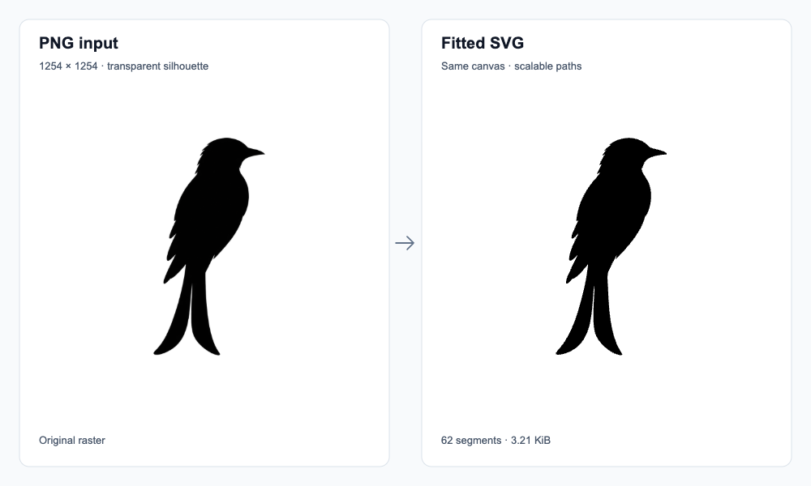

# contour-fit

Turn a silhouette PNG into SVG curves, with a report showing how closely the
curves follow the input outline. Use it for single-color logos, icons, and masks
where you want to control the fitting error.

The command-line tool runs locally. The Rust library provides the same fitting
pipeline for masks you already have in memory.

**Current version: `0.1.0-alpha.1`.** This is an unpublished alpha; build from
source using the instructions below. [繁體中文](docs/zh-TW/README.md)

## See an example



This bird is the first user-provided example converted with contour-fit. The
SVG keeps the original 1254 × 1254 canvas and transparent background. The white
panels above are only for display.

| Measurement | Result | What it tells you |
| --- | --- | --- |
| SVG size | 3,292 bytes | Stores the outline as scalable paths. |
| Curve segments | 62 | Total across all 3 extracted contours. |
| Error upper bound | 0.983 px | Passes the requested 1 px fitting limit. |
| Raster overlap (IoU) | 99.49% | Overlap when the SVG is rendered at the input size. |

These measurements describe this image, not a guarantee for every input.
The distance reference is the outline extracted from the PNG at the selected
threshold. [How the checks work](docs/quality.md).

[Original PNG](docs/assets/demo/bird-source.png) ·
[Generated SVG](docs/assets/demo/bird.svg) ·
[Full report](docs/assets/demo/bird-report.json) ·
[Demo source and artwork permissions](docs/assets/demo/README.md)

## Try it

Install [Rust with rustup](https://rustup.rs/). The repository pins the toolchain
to Rust 1.97.0. Start with the included bird so you can compare your result:

```sh
git clone https://github.com/asgoshawk/contour-fit.git
cd contour-fit
cargo build --release --locked
mkdir -p artifacts
./target/release/contour-fit docs/assets/demo/bird-source.png \
  -o artifacts/bird.svg \
  --report artifacts/bird-report.json \
  --debug-dir artifacts/bird-debug
```

Open `artifacts/bird.svg` to see the vector output. The JSON report contains error
measurements and stage timings. `bird-debug/preview.png` shows the rendered SVG;
`bird-debug/overlay.png` compares the extracted outline in red with the fitted
curves in blue.

Choose new output names when running again: existing files are never overwritten.
Parent directories must exist; only the optional debug directory is created.
Conversion does not use the network.

### Convert your own image

Run from the repository root, replacing `input.png` with your file:

```sh
./target/release/contour-fit input.png -o artifacts/output.svg
```

The default settings suit transparent silhouettes and opaque black-on-white
images. Auto mode uses alpha if any pixel is nonopaque; otherwise it treats dark
pixels as foreground.

| Input or goal | Additional flags |
| --- | --- |
| Select transparency explicitly | `--channel alpha` |
| White silhouette on an opaque black background | `--channel luminance --invert` |
| Allow only a quarter-pixel fitting error | `--tolerance 0.25` |
| Inspect the fit | `--report artifacts/output-report.json --debug-dir artifacts/output-debug` |
| Skip the optional curve-merging pass | `--no-merge` |

Smaller tolerances usually need more curves and work. `--no-merge` skips the
attempt to reduce segment count after fitting. See all options with
`./target/release/contour-fit --help`.

## What to expect

The default error limit is **1 pixel at the input image's size**. After fitting,
an independent validator checks distance, separate components, and nested holes.
The SVG's rounded coordinates are checked again before any output is written.

The tool keeps the canvas and small details, including isolated marks. It does
not automatically remove noise, delete holes, or crop. Output uses `currentColor`
and closed subpaths with `evenodd` fill; an inline SVG can inherit a page's text
color.

Use silhouette PNGs. Photo segmentation, animated PNG, and color vectorization
are outside this alpha's scope. Distance and topology checks use floating-point
arithmetic with a finite checking resolution. They do not recover an unknown
original vector drawing or provide a formal proof. Very noisy inputs or tight
tolerances can hit resource limits and fail without writing an SVG.
[Metric definitions and numerical limits](docs/quality.md).

## Use the Rust library

Use this unpublished alpha through a path dependency pointing to your local
checkout. For an app in a directory next to `contour-fit`:

```toml
[dependencies]
contour-fit-core = { path = "../contour-fit/crates/contour-fit-core" }
```

`contour-fit-core` accepts a mask whose values range from 0 (background) to 1
(foreground). This small example has one foreground pixel in a 2 × 2 mask:

```rust
use contour_fit_core::{FitError, FitOptions, RasterField, vectorize};

fn main() -> Result<(), FitError> {
    let field = RasterField::new(2, 2, vec![1.0, 0.0, 0.0, 0.0])?;
    let result = vectorize(&field, &FitOptions::default())?;
    assert!(result.report.hausdorff_upper_bound_px <= 1.0);
    Ok(())
}
```

The result contains closed paths, contour parent/depth metadata, reference
outlines, and a quality report. The core performs no file I/O; the CLI handles
PNG decoding, SVG export, and diagnostic rendering. Before 1.0, minor releases
may change the public API; patch releases remain compatible.

## Work on the project

Feature PRs target `develop`. Releases follow
`feature → develop → release/X.Y.Z → production`, with alpha candidates on the
release branch and official versions on `production`. No workflow automatically
publishes a release.

[CONTRIBUTING](CONTRIBUTING.md) covers TDD, coding conventions, and local checks.
CI checks Linux and Apple Silicon using standard runners for this public repo.
Candidate packaging is manual; its artifacts expire after 7 days.
[GitHub Free scope and storage limits](docs/releases.md#github-free-and-ci-scope).

Read further according to what you need:

- [Quality](docs/quality.md): what the report measures and where its guarantees stop.
- [Architecture](docs/architecture.md): how extraction, fitting, and validation fit together.
- [Dependencies](docs/dependencies.md): package choices, licenses, and supply-chain review.
- [Performance](docs/performance.md): measured time and memory, with reproduction commands.
- [Releases](docs/releases.md): branches, versions, and acceptance gates.

## License

The software is [MIT licensed](LICENSE). Dependencies retain their own licenses;
distribution artifacts include the texts listed in [THIRD_PARTY_NOTICES](THIRD_PARTY_NOTICES.md).
Input artwork and generated outputs do not inherit the software license.
See the [demo notice](docs/assets/demo/README.md) for the included bird artwork.
